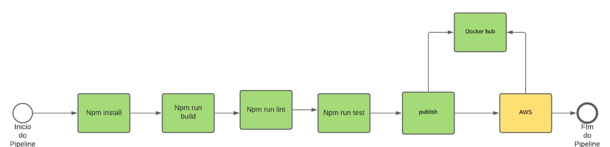
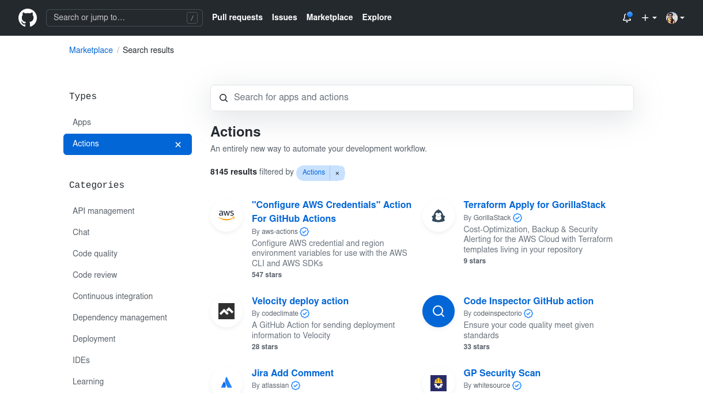

# CI/CD GitHub Actions

Repositorio do trabalho final para a disciplina CI /CD do curso [DevOps Enginnering](https://www.fiap.com.br/mba/mba-em-devops-engineering-integration-architecture);

## Grupo

| Integrante        | RM        |
|-------------------|-----------|
| Kirmayr Roberto Tomaz Costa | 337016 |
| Matheus Cintra Gonçalves | 338893 |
| Pedro Miranda Santos Bueno dos Reis | 338209 |

## Descrição

Exemplo de pipeline CI/CD usando GitHub Actions para automatizar os fluxos de buid e deploy de uma aplicação NodeJS + Express publicada num ambiente ECS da AWS.

## Arquitetura

## GitHub Actions

O Github actions é uma ferramenta gratuita disponivel no Github que nos permite automatizar diversos processos e fluxos, nesse exemplo iremos automatizar os fluxos de build, teste e deploy de uma aplicação NodeJS.

### PROS

* Estrutura YAML
* Documentação Rica
* Comunidade
* Marketplace

### Contras (Dificuldades)

* Plugin Docker (Digest da Imagem divergente do Docker Hub)

### Documentação

A documentação é rica em exemplos das mais diversas linguagens e tecnologias. Incluse os exemplos da documentação são a fundação do nosso exemplo.

* [Home da Documentação](https://docs.github.com/pt/actions)
* [Documentação do uso c/ NodeJS](https://docs.github.com/pt/actions/guides/building-and-testing-nodejs)
* [Documentação do up p/ Dockerhub](https://docs.github.com/pt/actions/guides/publishing-docker-images)
* [Documentação do pub na AWS](https://docs.github.com/pt/actions/guides/deploying-to-amazon-elastic-container-service)

### Marketplace

O [GitHub Marketplace](https://github.com/marketplace?type=actions) tem diversos pacotes de actions diponiveis para incluir no seu workflow.

